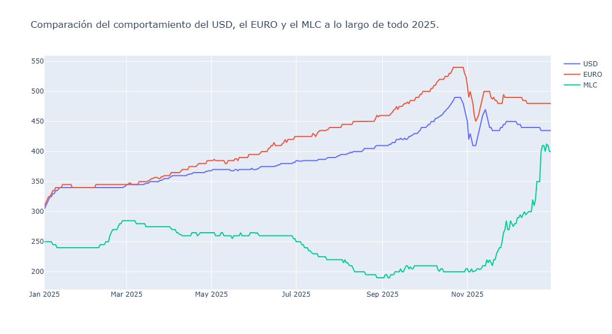
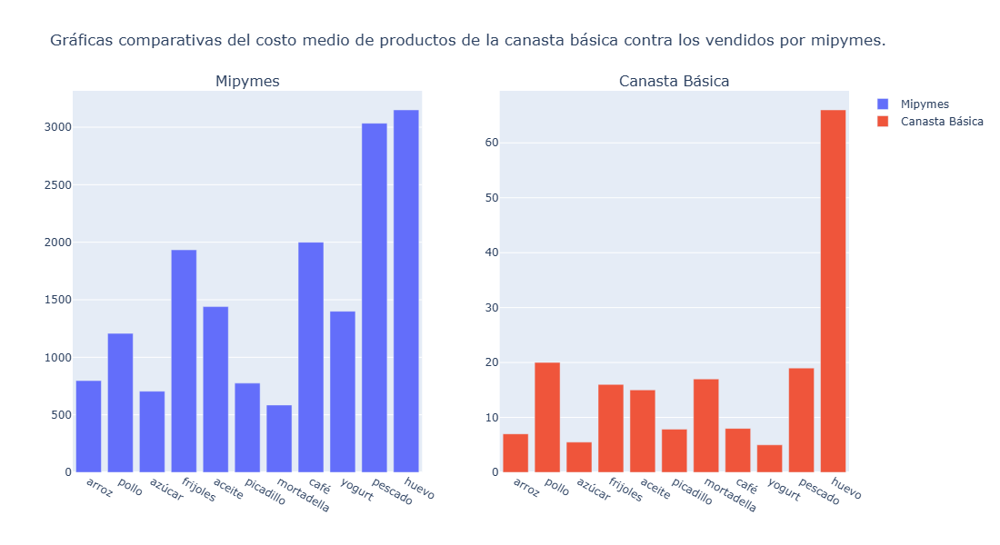
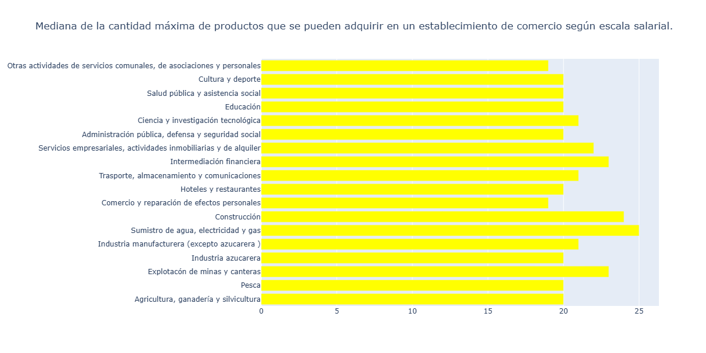
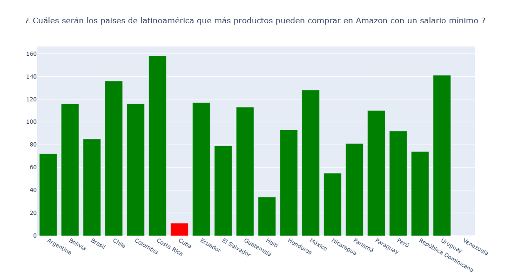
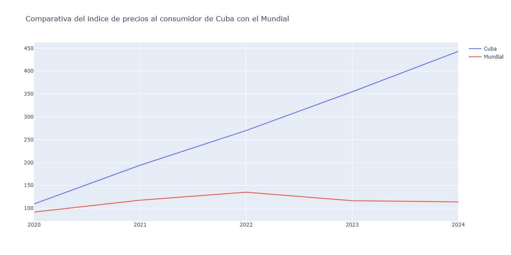

 PurchaseGAP es un proyecto de ciencia de datos que analiza cómo las fluctuaciones del dólar estadounidense y otras divisas extranjeras impactan directamente en los precios locales en Cuba. Su propósito central es mostrar cómo estos cambios afectan la capacidad de compra del cubano de a pie, revelando la brecha creciente entre salarios y costos de productos básicos. Al estudiar la dinámica de inflación y la accesibilidad del consumidor, el proyecto busca visibilizar los mecanismos que limitan el acceso a bienes esenciales y explicar por qué la vida cotidiana se vuelve cada vez más difícil para la mayoría de la población.

 Para todas gráficas se uso Plotly con sus clases express y graph_objects, y para apoyar a limpiar los datos para mostrarlos en los gráficos se usaron funciones propias creadas para el proyecto en un archivo aparte.

 Las fuentes de datos que se capturaron fueron:

- 30 mipymes de venta minorista en CUP.
- Anuario estadístico de 2024 publicado por la ONEI.
- Boletines mensuales de IPC de la ONEI.
- Salario media de Cuba hasta diciembre de 2024 según la ONEI.
- Tasas de cambio de El Toque.
- Listado de actores económicos registrados por el MEP (Ministerio de economía y planificación)s.
- Precios de los productos de la canasta familiar normada según el MINCIN (Ministerio de Comercio Interior): https://www.mincin.gob.cu/es/faq/cuales-son-los-precios-de-los-productos-de-la-canasta-familiar-normada.
- Precios de los algunos de los productos más vendidos en amazon en 15 categorías entre alimentos y aséos.

 1 - Para mostrar el mapa de cuba con la cantidad de mipymes que hay por habitante obtuve la poblacion de las distintas provincias de Cuba de la ONEI más datos de las mipymes registradas hasta el momento según MEP (Ministerio de economía y planificación) en el cual es este último tuve que hacer limpiezas manuales en los datos debido a errores en los datos de origen aunque se quedaron 34 mipymes que no tienen definidas si son de gestión privada o estatal y los datos de las mipymes se almacenaron en un archivo json con la siguiente estructura:

- {
  "1": {
  "name": "Panadería Glez",
  "city": "ARTEMISA",
  "subject": "MIPYME PRIVADA",
  "activity": "Producción de alimentos (elaboración de pan y confiterías, y derivados de la harina)."
  },
  etc...
  }

 Y para el mapa en el cual se muestran los datos se uso el geojson del repositorio el profesor Yudivian de la MATCOM, UH, https://github.com/yudivian/cuba-geojsons -> [Geojson](data\geo_json\geojson_by_region_division\by_provinces\cuba.geojson), el cual se tuvo que cambiar el nombre a 3 provincias por errores ortográficos y el resultado fue un mapa construido con plotly express.

 2- Para analizar los datos se recogieron datos de la fuente que más usado como referencia para saber precio del toque en mercado informal "El Toque". Para ello scrapee obtuve los datos del toque desde incios de año hasta la mitad de diciembre a través de su API usando la biblioteca para python httpx y luego para mostrar datos se utilizó la biblioteca para python plotly para mostrar un gráfico atractivo para apreciar el comportamiento USD, EURO y MLC durante el año 2025.

- los datos del precio del se organizaron en un json con la siguiente estructura de ejemplo de dentro de un diccionario:"

  "año-mes-día": {
        "TRX": 132.0,
        "BTC": 460.0,
        "MLC": 412.0,
        "USDT_TRC20": 490.0,
        "USD": 435.0,
        "ECU": 480.0
    },

 3- Para comparar como se comportan los precios canasta básica contra los de las mipymes obtuve los precios de la canasta básica de la url oficial del MINCIN y para los precios de las mipymes de algunas que visité personalmente y otras que obtuve los precios por medio de scraping usando la herramienta de python playwright por dificultades por el transporte y problemas de salud. Y el resultado de dichas capturas de datos término en una gráfica de barras.

- Los datos que se obtuvieron de las mipymes antes mencionadas se estructuraron en un archivo json con las siguite estructura:

 {
    "0":{
        "name": "",
        "sales_category":null,
         "currency": "CUP",
        "horary":{
        "days": null,
        "hour" : null
    },
    "municipality":null,
    "city": null,
     "coordinates": [],
    "products": {
    }
}
}
 y nombrados y ordenados por el indice empezando desde el cero, para el caso en caso no se conozca el nombre oficial de la mipyme.

- Y los datos de la canasta básica :

  {
    "producto": precio,
    etc...
  }

 4- Para saber poder saber cual es la cantidad máxima de productos que se puede adquirir por establecimiento se utilizó la fuente de datos de las mipymes que se obtuvieron mas salarios medios por actividad económica publicados en la ONEI  y se almacenó en un archivo json con la sigueinete estructura:

  {
    'actividad': salario,
    etc...
  }

 5- Para comparar a Cuba con latinoamérica obtuve precios de productos de 15 categorías entre alimentos y productos de áseo en la tienda con mas expansión en américa latina (aunque no es la mas usada) que es Amazon y utilicé los salarios mínimos de todos los países de  provenientes de la wikipedia de donde se obtuvieron enlaces a fuentes oficiales de cada país del territorio, donde Cuba ocupa la seguna posición en los que menos productos se puede comprar en Amazon con el salario mínimo oficial con la siguiente estructura almacenada en un json:

- {
  categoría:{
  "producto": precio,
  etc...
  },
  etc...
  }
- Y los salarios en la siguiene estructura:

  {
    'país': salario,
    etc...
  }

 6- Y para analizar indice de precios al consumidor (IPC) se capturaron  datos de boletines mensuales de la ONEI que contienen los IPC de cada mes que toma como referencia los precios de 2010 y datos oficiales publicados por La FAO (Organización de las Naciones Unidas para la Alimentación y la Agricultura) que toma como referencia al período de 2014-2016, para comparar el IPC de Cuba con el mundial, como los años de referencia son distintos se tuvo que adaptar el mundial al 2010 para que esté a la par del IPC de Cuba, se logró dividiendo el IPC del año a analizar entre el IPC de ese mismo mes pero del 2010 y multiplicar el resultado por 100 para obtener un IPC que tome como referencia a 2010 en vez de 2014-2016 y poder graficar los resultados en un gráfico de lineas con mayor veracidad posible.

- El IPC de cada mes de la FAO de 2010 se almacenó en la estructura:

  {
    'mes': IPC
  }

- Y El IPC de la FAO  y el de Cuba del período a comparar IPC mundial con el de Cuba se almacenó en un json con la estructura:

  {
    'año':{
        'mes': ipc,
        etc...
    },
    etc...
  }

